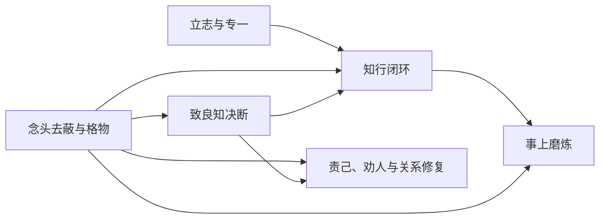

# 《王阳明心学入门三步走》Skill Index

- **作者**：度阴山
- **版本**：2025 年 6 月 EPUB
- **一句话主旨**：在具体处境中去除遮蔽判断的私欲与习气，以行动和复盘将修心落实为责任。
- **共享词典**：[GLOSSARY.md](GLOSSARY.md)
- **整书理解**：[BOOK_OVERVIEW.md](BOOK_OVERVIEW.md)
- **精华长文**：[DIGEST.md](DIGEST.md)

## Skills

### 觉察与决断

- [念头去蔽与格物](thought-debiasing/SKILL.md)：辨认遮蔽动机，转为负责的下一步。
- [致良知决断](conscience-grounded-decision/SKILL.md)：处理有多方利益和高后果的价值冲突。

### 行动与训练

- [知行闭环](knowledge-action-loop/SKILL.md)：把“知道”转成最小真实动作和反馈。
- [事上磨炼](practice-in-the-matter/SKILL.md)：在压力、冲突与职责中训练稳定反应。

### 方向与关系

- [立志与专一](aspiration-and-focus/SKILL.md)：收敛长期方向，抵抗比较、热点与好名。
- [责己、劝人与关系修复](self-reflection-feedback/SKILL.md)：用反己、劝正和边界代替争胜型指责。

## 关系图

## 推荐顺序

1. 念头去蔽与格物：建立动机和事实的区分。
2. 立志与专一：选择值得长期投入的方向。
3. 知行闭环：把方向变成第一轮真实行动。
4. 事上磨炼：在压力下稳定并修正能力。
5. 致良知决断：处理多方利益与责任冲突。
6. 责己、劝人与关系修复：将修养带入合作与冲突。
